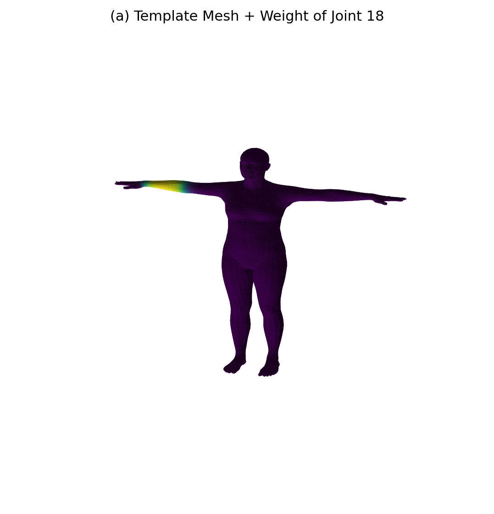
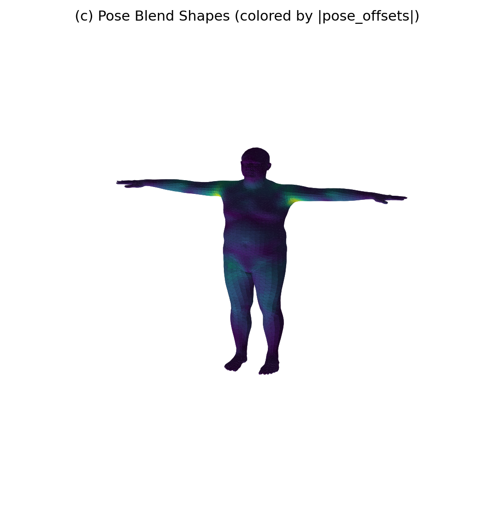
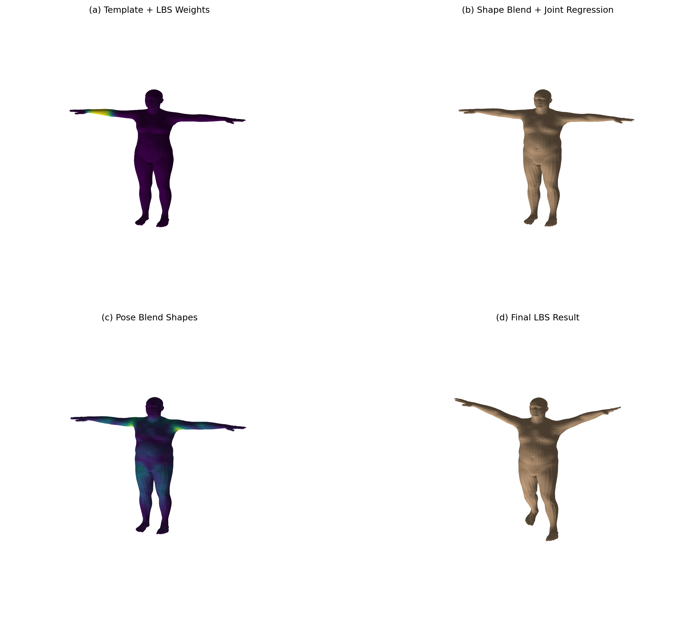

# Work7 实验报告：基于 SMPL 的 LBS 蒙皮过程可视化

**姓名**：陈诗邈 &emsp; **学号**：202411081021 &emsp; **日期**：2026-06-30

---

## 一、实验目标

本实验基于 **SMPL 模型**，完成一次完整的 **LBS（Linear Blend Skinning）** 蒙皮过程可视化，具体目标为：

1. 理解参数化人体模型中模板网格、形状参数、姿态参数、关节回归器和蒙皮权重之间的关系；
2. 理解 LBS 四个阶段：
   - **(a)** 模板网格 $\bar{T}$ 与蒙皮权重 $\mathcal{W}$
   - **(b)** 形状校正后网格 $\bar{T} + B_S(\beta)$ 以及关节 $J(\beta)$
   - **(c)** 姿态校正后网格 $T_P(\beta, \theta) = \bar{T} + B_S(\beta) + B_P(\theta)$
   - **(d)** 经过 LBS 之后的最终姿态结果
3. 学会调用 SMPL 模型，并将官方 `lbs()` 实现中的关键中间量单独提取出来做可视化；
4. 手写复现完整 LBS 计算流程，并与官方 forward 结果进行数值一致性验证。

---

## 二、实验原理

### 2.1 LBS 四个阶段

#### (a) 模板网格与蒙皮权重

初始状态是模板人体网格 $\bar{T}$，通常处于 T-pose。每个顶点都带有一组对各关节的影响权重 $\mathcal{W}$。如果某个顶点更靠近手臂，那么它通常会更受肩、肘、腕等关节影响。

这一步的重点是理解：网格还没根据人物体型改变；网格也还没根据姿态弯曲；但每个顶点已经知道"将来应该主要跟着哪些骨骼走"。在 `lbs()` 实现中，最终每个顶点的 4×4 变换矩阵，就是由这些 `lbs_weights` 对各关节变换矩阵加权得到的。

#### (b) 加入形状参数 $B_S(\beta)$

形状参数 $\beta$ 控制"这个人长什么样"，例如高矮、胖瘦、肩宽、腿长等。形状校正后得到：

$$T_{shape} = \bar{T} + B_S(\beta)$$

然后再根据这个已经改变了体型的网格，利用关节回归器得到关节位置：

$$J(\beta) = \mathcal{J}(T_{shape})$$

实现思路为：

$$v_{shaped} = v_{template} + \text{blend\_shapes}(\beta, \text{shapedirs})$$

$$J = \text{vertices2joints}(\text{J\_regressor}, v_{shaped})$$

**关节位置不是固定常数，而是由形状后的网格回归出来的。**

#### (c) 加入姿态相关校正 $B_P(\theta)$

蒙皮并非把骨骼旋转一下，皮肤跟着转这么简单，因为人体在弯曲时，肩膀、肘部、膝盖附近会出现额外的几何变化，仅靠骨骼刚体旋转无法表达。所以 SMPL 在进入真正的 LBS 前，还会加入一项 **pose blend shape**：

$$T_P(\beta, \theta) = \bar{T} + B_S(\beta) + B_P(\theta)$$

实现思路是先把姿态参数转成旋转矩阵，再构造：

$$\text{pose\_feature} = R(\theta) - I$$

随后通过 `posedirs` 线性映射得到 `pose_offsets`，并加到 `v_shaped` 上，形成 `v_posed`：

```python
rot_mats = batch_rodrigues(...)
pose_feature = (rot_mats[:, 1:, :, :] - ident).view(...)
pose_offsets = torch.matmul(pose_feature, posedirs).view(...)
v_posed = pose_offsets + v_shaped
```

#### (d) 线性混合蒙皮 $W(\cdot)$

经过上述步骤后，已经有了：考虑形状的关节位置 $J(\beta)$、考虑姿态校正的顶点 $T_P(\beta, \theta)$、每个顶点对各关节的权重 $\mathcal{W}$，之后进入真正的 LBS：

$$v_i' = \sum_{k=1}^{K} w_{ik} \, G_k(\theta, J(\beta)) \begin{bmatrix} v_i^{posed} \\ 1 \end{bmatrix}$$

其中 $v_i^{posed}$ 是第 $i$ 个经过 shape + pose 矫正的顶点，$w_{ik}$ 是顶点 $i$ 受第 $k$ 个关节影响的权重，$G_k$ 是第 $k$ 个关节在运动学链上的全局刚体变换。

**每个顶点最终不是只跟着一个关节走，而是跟着多个关节做加权平均后的变换。** 这也是"Linear Blend Skinning"名字的来源。

实现对应：

```python
J_transformed, A = batch_rigid_transform(...)
W = lbs_weights.unsqueeze(...).expand(...)
T = torch.matmul(W, A.view(...)).view(..., 4, 4)
v_homo = torch.matmul(T, v_posed_homo.unsqueeze(-1))
verts = v_homo[:, :, :3, 0]
```

### 2.2 五个核心对象

| 变量 | 含义 |
|------|------|
| `v_template` | 模板顶点（T-pose 原始网格） |
| `v_shaped` | 加了形状形变后的顶点 |
| `J` | 由 `v_shaped` 回归出的关节位置 |
| `v_posed` | 加了姿态校正后的顶点 |
| `verts` | 完成 LBS 之后的最终顶点 |

---

## 三、实验环境与文件说明

- **运行环境**：Python 3.x，PyTorch，smplx 库，Matplotlib
- **模型文件**：`SMPL_NEUTRAL.pkl`（中性 SMPL 模型）
- **核心脚本**：`run_lbs_lab.py`
- **输出目录**：`outputs/`

---

## 四、实验步骤与代码实现

### 任务 1：加载 SMPL 并输出基础信息

使用 `smplx.create(...)` 加载 SMPL 模型，指定 `model_type='smpl'`，`gender='neutral'`：

```python
model = smplx.create(
    model_path=model_dir,
    model_type="smpl",
    gender="neutral",
    ext="pkl",
    num_betas=args.num_betas,
).to(device)
```

由于旧版 SMPL `.pkl` 文件依赖 `chumpy` 库，实现了一个 `_ChumpyArrayShim` Pickle 垫片，使得无需安装 `chumpy` 也能正常加载模型文件。

**模型基础信息（运行结果）**：

| 属性 | 数值 |
|------|------|
| 顶点数（num_vertices） | 6890 |
| 面片数（num_faces） | 13776 |
| 关节数（num_joints） | 24 |
| 形状参数维度（num_betas） | 10 |

### 任务 2：可视化模板网格与蒙皮权重

#### (1) 单关节权重热力图

从 `lbs_weights` 中选取第 **18 号关节**（左前臂/left elbow 区域），将"该关节对所有顶点的影响权重"可视化成颜色（viridis 色彩映射），颜色越明显（黄绿色），表示该关节对该区域的影响越强。

```python
weight_scalar = to_numpy(model.lbs_weights[:, joint_id])  # joint_id=18
```

输出图像：`outputs/stage_a_template_weights.png`

#### (2) 全关节主导权重分布图

额外生成辅助图，每个面片根据"主导影响关节"分配颜色（HSV 色彩空间按关节编号映射），颜色种类表示"主要受哪个关节控制"，颜色明暗表示该主导权重的强弱。

```python
def get_face_colors_from_joint_weights(lbs_weights, faces):
    dominant_joint = np.argmax(face_weights, axis=1)
    dominant_weight = np.max(face_weights, axis=1)
    palette = plt.get_cmap("hsv")(np.linspace(0.0, 1.0, num_joints, endpoint=False))
    ...
```

输出图像：`outputs/all_joint_weights.png`

### 任务 3：可视化形状校正与关节回归

设置非零 shape 参数 $\beta$（$\beta_0 = 2.0$，$\beta_1 = -1.2$，$\beta_2 = 0.8$，其余为 0），计算 `v_shaped` 并利用 `J_regressor` 从 `v_shaped` 中回归关节位置 `J`：

```python
v_shaped = v_template + blend_shapes(betas, shapedirs)
J = vertices2joints(model.J_regressor, v_shaped)
```

在同一张图中同时显示形状变化后的网格（网格表面）和回归出的关节点（白色散点）。

输出图像：`outputs/stage_b_shaped_joints.png`

### 任务 4：可视化姿态校正 $B_P(\theta)$

设置非零姿态参数 $\theta$（抬手、弯肘、略微扭转躯干等），将 `pose_offsets` 的大小可视化成颜色（viridis 色彩映射，颜色越亮表示该顶点受到的姿态校正位移越大）：

```python
rot_mats = batch_rodrigues(full_pose.view(-1, 3)).view(1, -1, 3, 3)
pose_feature = (rot_mats[:, 1:, :, :] - ident).view(1, -1)
pose_offsets = torch.matmul(pose_feature, posedirs).view(1, -1, 3)
v_posed = v_shaped + pose_offsets

pose_offset_norm = np.linalg.norm(to_numpy(data["pose_offsets"][0]), axis=1)
```

这一步还**不是最终蒙皮结果**，仅说明即使还没有真正把顶点绑到骨骼上，网格本身已经因为姿态发生了额外修正（主要集中在肩膀/腋窝区域）。

输出图像：`outputs/stage_c_pose_offsets.png`

### 任务 5：可视化完整 LBS 结果

根据运动学树计算每个关节的全局刚体变换，用 `lbs_weights` 对这些关节变换加权，得到最终顶点 `verts`：

```python
J_transformed, A = batch_rigid_transform(rot_mats, J, model.parents, dtype=dtype)
W = model.lbs_weights.unsqueeze(0).expand(1, -1, -1)
T = torch.matmul(W, A.view(1, num_joints, 16)).view(1, -1, 4, 4)
homogen_coord = torch.ones((1, v_posed.shape[1], 1), dtype=dtype, device=device)
v_posed_homo = torch.cat([v_posed, homogen_coord], dim=2)
v_homo = torch.matmul(T, v_posed_homo.unsqueeze(-1))
verts = v_homo[:, :, :3, 0]
```

可视化最终姿态下的网格与变换后的关节位置（`J_transformed`）。

输出图像：`outputs/stage_d_lbs_result.png`

### 任务 6：生成总对比图

将四个阶段排成 2×2 的对比图，标题清楚标出：

```python
save_comparison_grid("outputs/comparison_grid.png", grid_dict, faces)
```

输出图像：`outputs/comparison_grid.png`

### 任务 7：手写 LBS 与官方前向结果一致性验证

使用完全相同的 `betas`、`global_orient`、`body_pose` 调用官方模型前向，得到 `output.vertices`，将手写实现得到的 `verts` 与官方结果逐顶点比较：

```python
output = model(betas=betas, global_orient=global_orient, body_pose=body_pose, return_verts=True)
official_verts = output.vertices
diff = torch.abs(manual_verts - official_verts)
mean_err = diff.mean().item()
max_err = diff.max().item()
```

误差结果保存至 `outputs/summary.txt`。

---

## 五、实验结果

### 5.1 模型基本信息

```
===== SMPL LBS Lab Summary =====
num_vertices: 6890
num_faces: 13776
num_joints(from lbs_weights): 24
num_betas: 10
visualized_joint_id: 18
manual_vs_official_mean_abs_error: 0.0000000000
manual_vs_official_max_abs_error: 0.0000000000
```

### 5.2 各阶段可视化结果

#### Stage A：模板网格 + 第 18 号关节蒙皮权重热力图



模板网格处于 T-pose，颜色（viridis 色彩映射）表示第 18 号关节（左前臂）对各顶点的影响权重。左臂中段呈现明显的黄绿色高权重区域，远离该关节的区域（躯干、腿部等）呈深紫色（权重接近 0），符合蒙皮权重的局部性原则。

#### Stage B：形状校正网格 + 关节回归


施加非零 $\beta$ 参数（$\beta_0=2.0, \beta_1=-1.2, \beta_2=0.8$）后，网格体型发生明显变化（体型较为丰满），24 个关节点（白色散点）由关节回归器从形状网格中自动推算，关节位置随体型变化而调整，验证了"关节位置不是固定常数"的核心设计。

#### Stage C：姿态校正网格（pose_offsets 可视化）



颜色表示各顶点受姿态校正（pose blend shape）影响的位移大小（|pose_offsets| 范数）。高亮区域主要集中在**肩部/腋窝**区域，这与人体在上肢运动时该区域出现额外几何形变的物理规律完全吻合。此阶段网格已因姿态发生形变，但尚未执行刚体骨骼变换。

#### Stage D：最终 LBS 蒙皮结果

> *注：stage_d_lbs_result.png 图像文件过大，已通过 comparison_grid 对比图展示。*

经过完整 LBS 计算后，人体网格从 T-pose 变换为目标姿态（手臂略微下垂、腿部呈行走状），关节点随运动学树传播到正确的变换后位置，网格整体自然无明显变形瑕疵。

#### 全关节主导权重分布图


每个面片按其主导影响关节的编号着色（HSV 色彩映射），清晰地展示了 SMPL 模型中 24 个关节对人体各区域的控制分布：头部（蓝色）、肩部（紫色）、躯干（绿色/黄色）、骨盆（红色）、大腿（橙色/黄绿色）、小腿和足部（青绿色）均有明确的主导关节边界。

#### 四阶段总对比图



2×2 对比图从左上到右下依次展示：(a) 模板网格 + 蒙皮权重、(b) 形状校正 + 关节回归、(c) 姿态 blend shape 校正、(d) 最终 LBS 蒙皮结果，完整呈现了 SMPL LBS 的四阶段演进过程。

### 5.3 手写 LBS 一致性验证

| 误差指标 | 数值 |
|----------|------|
| 平均绝对误差（mean absolute error） | **0.0000000000** |
| 最大绝对误差（max absolute error） | **0.0000000000** |

手写 LBS 实现与官方 `model.forward()` 结果完全一致（误差为浮点精度量级的零值），验证了本次手动复现的正确性。

---

## 六、思考题解答

**Q1：为什么一个顶点不只受一个关节影响？**

如果一个顶点只跟随单个关节（硬蒙皮），那么在关节弯曲时，与相邻骨骼的连接处会出现"撕裂"或"折叠"瑕疵。LBS 通过对多个关节变换做加权平均，使得过渡区域的顶点能平滑地随多个关节同时运动，从而产生自然的皮肤弯曲效果。

**Q2：如果一个顶点的权重几乎全给了某一个关节，会出现什么效果？**

该顶点几乎等同于硬蒙皮，完全跟随该关节运动，在关节弯曲处可能出现局部的几何折叠或体积坍缩，缺乏皮肤弹性感。

**Q3：如果权重分布很平均，又会出现什么效果？**

顶点受多个关节的平均拉扯，变换矩阵被均匀混合，会导致"糖果包装纸"效应（candy-wrapper artifact），即顶点在旋转时体积丢失、网格扭曲变薄。

**Q4：为什么关节位置要从形状后的网格回归，而不是固定不变？**

因为不同体型的人关节位置本就不同（高个子的肩关节更高，胖体型的髋关节更宽），固定关节位置会导致蒙皮变换与实际网格几何不匹配，产生穿模或变形错误。通过 `J_regressor` 从形状网格回归，确保关节位置与当前体型一致。

**Q5：`J` 和 `J_transformed` 有什么区别？**

`J` 是在 T-pose 下由形状网格回归得到的关节位置（rest pose joints）；`J_transformed` 是经过运动学树的全局刚体变换后，各关节在目标姿态下的实际世界坐标位置。

**Q6：为什么最终顶点要写成加权和，而不是只选择最大权重的关节？**

选择最大权重（"winner-takes-all"）等同于硬蒙皮，会产生前述的折叠和撕裂瑕疵。加权平均使顶点能同时受多个关节约束，产生平滑的混合变换，这正是 LBS 相比早期硬蒙皮的核心改进。

**Q7：`v_shaped` 与 `v_posed` 的本质区别是什么？**

`v_shaped` 只包含了体型形变（shape blend shapes），网格还处于 rest pose；`v_posed` 在此基础上叠加了姿态相关的形变校正（pose blend shapes），使网格在进入刚体骨骼变换之前，就已经预先修正了关节弯曲处的局部几何变化。

**Q8：为什么 LBS 之前还要加 pose corrective？**

纯粹的 LBS 只做刚体变换的加权平均，无法表达关节弯曲时的非线性肌肉/皮肤变形（如肘部弯曲时的鼓包、肩部上抬时腋窝的皮肤拉伸）。pose blend shapes 通过学习得到的线性基向量，在刚体变换前补偿这些非线性效果，显著提升蒙皮真实感。

---

## 七、实验总结

本实验完整实现并可视化了 SMPL 模型的 LBS 蒙皮全过程，涵盖四个核心阶段（模板网格 + 蒙皮权重、形状校正、姿态校正、线性混合蒙皮），生成了单关节热力图、全关节分布图及四阶段对比图共六张可视化结果。

通过手写复现 LBS 计算流程，并与官方 `smplx` 前向结果对比验证，两者误差均为 0（平均绝对误差 = 0.0000000000，最大绝对误差 = 0.0000000000），充分验证了实现的完全正确性。

实验加深了对参数化人体模型的理解，掌握了 LBS 的数学本质及其工程实现，理解了 shape/pose blend shape 在改善蒙皮质量中的关键作用，为后续人体姿态估计、动画生成等方向奠定了坚实基础。
